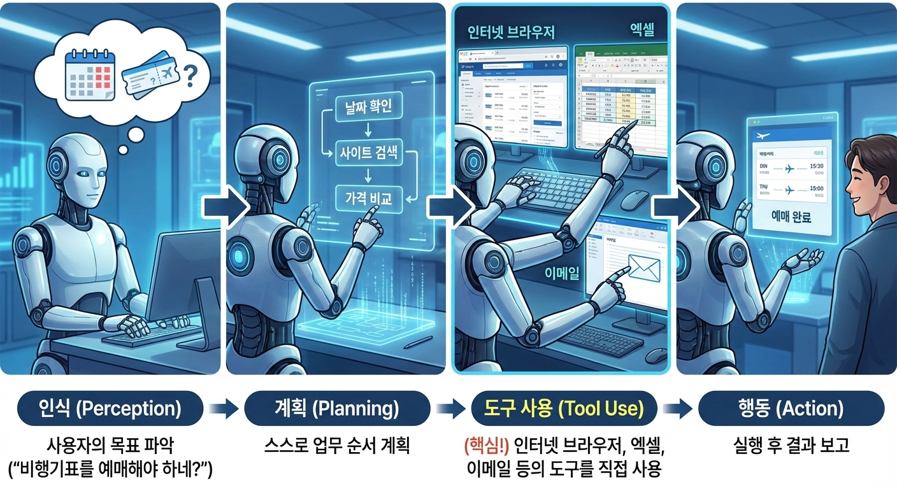

요즘 AI 업계에서 가장 핫한 키워드를 꼽으라면 단연 **'AI 에이전트(AI Agent)'**인 것 같다. 단순히 챗GPT와 대화하는 것을 넘어, 이제는 AI가 직접 일을 수행하는 시대로 가고 있다는데...

오늘 공부한 **AI 에이전트의 개념**과 이를 구현하기 위한 필수 기술인 **랭체인(LangChain)**에 대해 초보자 관점에서 쉽게 정리해 본다.

---

## 1. AI 에이전트(AI Agent)란? : "손발 달린 똑똑한 비서"

처음에는 "그냥 챗GPT랑 같은 거 아니야?"라고 생각했는데, 공부해보니 명확한 차이가 있었다. 가장 큰 차이점은 바로 **'행동(Action)'의 유무**다.

이해하기 쉽게 비유하자면 다음과 같다.

  

* **기존 AI (LLM, 챗GPT):** **"걸어 다니는 백과사전"**
    * 내가 "제주도 비행기표 어떻게 예매해?"라고 물으면, 예매하는 **방법**을 아주 친절하게 글로 알려준다. 하지만 직접 예매를 해주진 않는다.
* **AI 에이전트:** **"손발이 달린 유능한 인턴"**
    * 내가 "다음 주 제주도 비행기표 제일 싼 걸로 예매해 줘"라고 시키면, **직접 항공사 사이트에 들어가서 검색하고, 결제창까지 띄워준다.**

즉, **'말만 하는 로봇'**에서 **'일을 처리하는 로봇'**으로 진화한 것이 바로 AI 에이전트다.

### AI 에이전트는 어떻게 일할까?

에이전트는 단순히 명령을 듣는 게 아니라 아래와 같은 프로세스로 사고하고 움직인다.

  

1. **인식(Perception):** 사용자의 목표 파악 ("비행기표를 예매해야 하네?")
2. **계획(Planning):** 스스로 업무 순서 계획 (날짜 확인 → 사이트 검색 → 가격 비교)
3. **도구 사용(Tool Use):** **(핵심!)** 인터넷 브라우저, 엑셀, 이메일 등의 도구를 직접 사용
4. **행동(Action):** 실행 후 결과 보고

---

## 2. 여기서 'LangChain(랭체인)'은 왜 중요할까?

AI 에이전트를 공부하다 보니 자연스럽게 **'랭체인(LangChain)'**이라는 기술이 튀어나왔다. 개발자들이 에이전트를 만들 때 거의 표준처럼 사용하는 프레임워크라고 한다.

  

왜 랭체인이 중요할까? **'자동차 만들기'**에 비유하니 바로 이해가 되었다.

* **LLM (엔진):** 엄청난 지능과 힘을 가졌지만, 엔진 혼자서는 굴러갈 수 없다.
* **LangChain (차체, 바퀴, 핸들):** 엔진의 힘을 바퀴로 전달하고(행동), 운전자가 원하는 방향으로 가게 해준다(조작).

즉, **LLM이라는 고성능 엔진을 가지고 실제로 굴러가는 자동차(서비스)를 만들게 해주는 조립 키트**가 바로 랭체인인 것이다.

### 랭체인이 해주는 3가지 역할

1. **도구 쥐여주기 (Tools):** "자, 이건 검색창이고 이건 계산기야"라고 AI에게 도구를 연결해 준다.
2. **기억력 제공 (Memory):** 금붕어 같은 AI에게 이전 대화 내용을 기억하게 해준다.
3. **생각의 사슬 연결 (Chains):** 검색 → 요약 → 메일 발송처럼 연속된 작업을 순서대로 처리하게 관리한다.

---

## 3. 결론: "대화의 시대"에서 "위임의 시대"로

오늘 학습을 통해 느낀 점은 AI의 패러다임이 바뀌고 있다는 것이다.
지금까지는 우리가 AI에게 질문하고 답을 얻어 **직접 일을 처리**했다면 AI 에이전트가 상용화되면 **AI에게 일을 시키고(위임) 우리는 결과만 확인**하면 된다.

단순 반복 업무는 AI 인턴에게 맡기고, 사람은 진짜 중요한 의사결정만 하는 시대.
그 중심에 **AI 에이전트**와 이를 만드는 **랭체인** 기술이 있다. 앞으로 이쪽 분야를 더 깊게 파봐야 할 이유가 분명해졌다.

---

**[오늘의 한 줄 요약]**
> AI 에이전트는 **'행동하는 비서'**이고, 랭체인은 그 비서를 만드는 **'필수 조립 키트'**다.  
이를 더 공부하고자 Rag계의 유명한 Teddynote님께서 작성하신 책으로 스터디를 할 예정이다.  
그 과정도 여기에 녹여내도록 하겠다.
