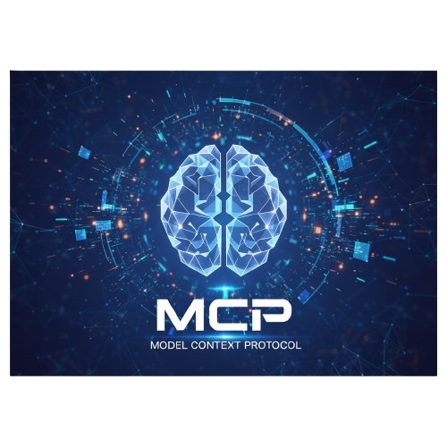
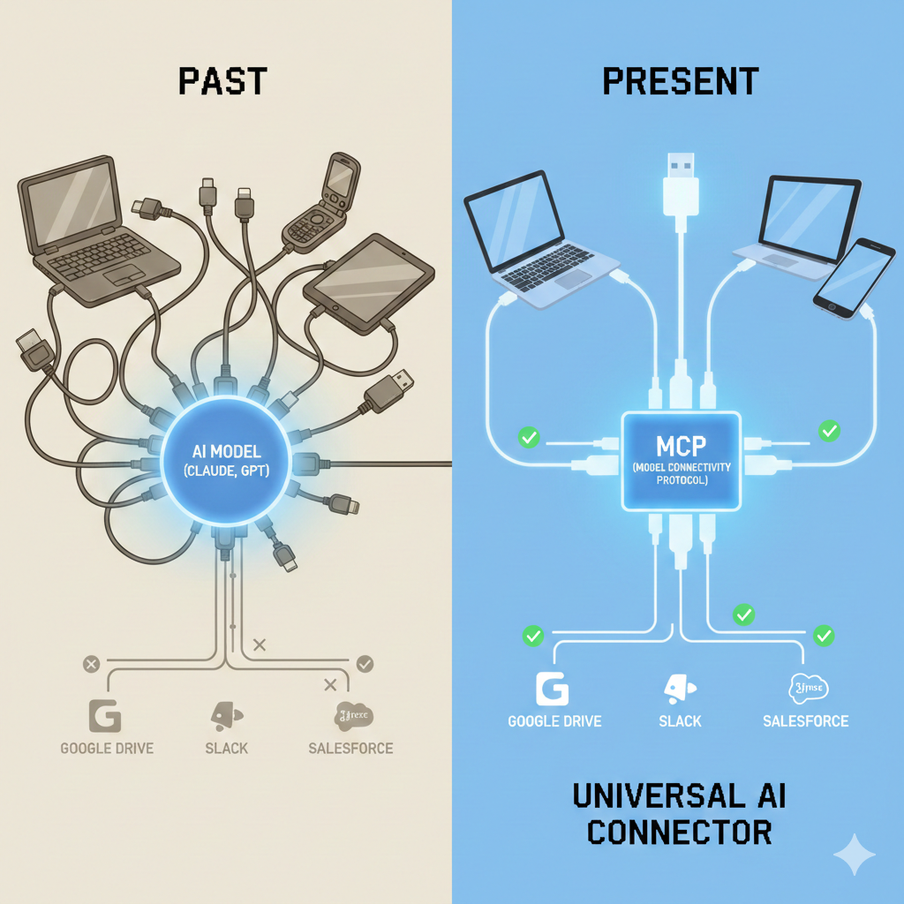

  

## [AI 공부] 🔌 MCP(Model Context Protocol)

최근 AI 업계에서 **MCP(Model Context Protocol)**라는 개념이 화두가 되고 있다. 앤트로픽(Anthropic)이 작년 11월에 공개한 이 프로토콜은 LLM(거대언어모델) 생태계의 '연결성' 문제를 해결할 핵심 열쇠로 꼽히는 것 같다.    
오늘은 이 MCP가 도대체 무엇인지, 왜 중요한지, 그리고 어떻게 작동하는지 내가 학습한 내용을 정리해 보았다.

---

### ❓ 1. MCP란 무엇인가?

**MCP(Model Context Protocol)**는 한마디로 **"AI 모델이 외부 데이터나 도구와 소통하는 방식을 표준화한 약속(프로토콜)"**이라고 이해하면 된다.

  

가장 이해하기 쉬운 비유는 **'USB-C 타입'**이다.
*   **과거:** 예전에는 전자기기마다 충전 단자가 제각각이어서(5핀, 8핀, 전용 단자 등) 호환이 안 되고 불편했다.
*   **현재:** **USB-C**가 표준이 되면서 케이블 하나로 노트북, 태블릿, 스마트폰을 모두 연결할 수 있게 되었다.

MCP가 바로 AI계의 USB-C인 셈이다. 기존에는 AI 모델(Claude, GPT 등)에 특정 데이터 소스(구글 드라이브, 슬랙 등)를 연결하려면 그때마다 전용 코드를 따로 짜야 했다. 하지만 MCP라는 표준 규격이 생기면서, **어떤 AI 모델이든 이 규격만 맞추면 다양한 도구와 데이터를 즉시 연결**할 수 있게 된 것이다.

### 💡 2. 왜 MCP가 필요한가? (등장 배경)

MCP가 등장하기 전, 개발자들은 소위 '노가다'에 시달려야 했다.

1.  **파편화된 연결 방식:** AI 모델마다, 그리고 연결하려는 도구마다 연결 방식이 다 달랐다. 이걸 '커스텀 구현'해야 했는데, 확장성이 매우 떨어졌다.
2.  **유지보수의 지옥:** 연결해야 할 도구가 늘어날수록 코드가 복잡해지고, 하나가 업데이트되면 전체를 뜯어고쳐야 하는 등 유지보수 부담이 엄청났다.

**MCP는 이런 골치 아픈 문제를 '표준화'로 해결한다.**
이제 개발자는 MCP 표준에 맞춰 도구(Server)를 딱 한 번만 만들어두면 된다. 그러면 Claude에서든, Cursor 에디터에서든, 혹은 다른 어떤 AI 플랫폼(Host)에서든 이 도구를 그대로 가져다 쓸 수 있게 되는 것이다. 이게 바로 MCP의 힘이다!

### ⚙️ 3. MCP의 작동 원리 (3-Layer Architecture)

MCP는 크게 세 가지 요소로 구성되어 작동한다. 이 세 가지가 어떻게 유기적으로 연결되는지 살펴보자.

  

*   **MCP 호스트 (Host):** AI를 사용하는 주체다. (예: Claude 데스크톱 앱, Cursor IDE, AI 에디터 등) 사용자의 요청을 받아서 처리를 시작하는 곳이라고 생각하면 된다.
*   **MCP 클라이언트 (Client):** 호스트 내부에서 서버와 소통하는 '연결자' 역할을 한다. 호스트의 요청을 서버에 똑똑하게 전달해 주는 역할이다.
*   **MCP 서버 (Server):** 실제 기능이나 데이터가 있는 곳이다. (예: 웹 검색 도구, 로컬 파일 탐색기, 슬랙 연동 도구 등) 우리가 만들거나 가져다 쓸 '도구'가 바로 서버인 셈이다.

**[작동 흐름]**    
사용자가 호스트(앱)에서 질문을 던짐 ➡️ 클라이언트가 적절한 서버(도구)를 호출 ➡️ 서버가 작업을 수행 후 결과 반환 ➡️ 호스트가 최종 답변 생성

이 구조 덕분에 각 요소들이 독립적으로 관리될 수 있어서 시스템이 훨씬 유연해지고 확장하기도 쉬워진다. 정말 잘 설계된 아키텍처라고 느꼈다.

### 🚀 4. 실제 활용: 마켓플레이스와 에이전트

MCP의 가장 큰 장점은 바로 **'사전 구축된 생태계'**라는 점이다. 내가 필요한 기능을 일일이 코딩할 필요 없이, 이미 누군가 만들어둔 **MCP 서버**를 가져와 내 AI에 쏙 장착하기만 하면 된다.

Smithery나 Glama 같은 MCP 마켓플레이스에는 이미 다양한 도구들이 올라와 있다.

*   **Web Search (Brave Search):** 내 AI에게 실시간 인터넷 검색 능력을 달아줄 수 있다.
*   **Sequential Thinking:** AI가 복잡한 문제를 풀 때, 단계별로 사고하도록 유도하여 답변의 논리력을 높여주는 도구다.

예를 들어, 나만의 'AI 에이전트'를 만들 때 예전에는 웹 검색 기능을 처음부터 구현해야 했다면, 이제는 **'Brave Search MCP 서버'를 다운받아 설정 파일에 추가하는 것만으로** 끝나는 거다. 정말 쉽고 편리해졌다고 생각한다.

### 📝 5. 정리하며: 연결의 혁명

공부하면 할수록 MCP는 단순한 기술 업데이트가 아니라, **AI 생태계의 판을 깔아주는 인프라 작업**이라는 생각이 강하게 들었다.

1.  **표준화된 연결:** LLM과 도구 사이의 소통 방식 통일
2.  **확장성:** 한 번 만든 도구는 어디서든 사용 가능 (One source, Multi-use)
3.  **유연한 시스템:** 호스트-클라이언트-서버의 분리로 유지보수 용이

