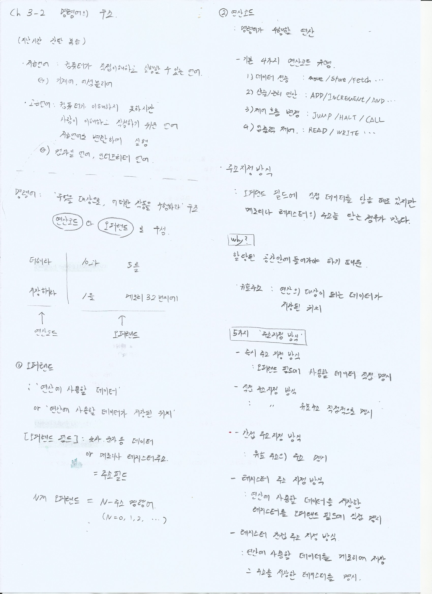

> 📚 참고: 강민철 지음, 혼자 공부하는 컴퓨터구조 + 운영체제

## 🧠 용어 정리

- **명령어(Instruction)**: CPU가 수행할 일을 지시하는 단위

- **연산코드(Opcode)**: 수행할 동작의 종류를 지정

- **오퍼랜드(Operand)**: 동작의 대상이 되는 데이터 또는 그 데이터의 위치(메모리 주소, 레지스터 등)

- **오퍼랜드 필드**: 명령어 비트 중 오퍼랜드를 표현하는 구간

  


## 🔧 명령어의 기본 구성

명령어는 보통 다음과 같이 표현됩니다.

```
[ 연산코드 | (선택) 주소지정모드 | 오퍼랜드1 | 오퍼랜드2 | ... ]
```

- **N개 오퍼랜드**를 가지면 **N-주소 명령어**라고 부릅니다. (N = 0, 1, 2, ...)

  


## 🧮 CPU가 수행하는 기본 연산 종류

- **데이터 이동**: move / load / store / push / pop / exchange 등

- **산술·논리 연산**: add / sub / mul / div / and / or / xor / shift 등

- **제어 흐름 변경**: jump / branch / call / return / interrupt / halt 등

- **입출력 제어**: read / write / flush / in / out / poll 등

  


## 📦 왜 주소를 더 많이 담을까?

오퍼랜드 필드에 데이터 자체를 담을 수도 있지만, 실제로는 **메모리나 레지스터의 주소**를 담는 경우가 더 많습니다. 그 이유는 명령어가 **제한된 길이** 안에 들어가야 하고, 큰 데이터를 그대로 담기 비효율적이기 때문입니다. 핵심은 "연산 대상이 저장된 위치"를 명확히 지정하는 것입니다.


## 🧭 대표적인 5가지 주소지정 방식

아래 표기에서 `M[A]`는 "메모리 주소 A의 내용"을 의미합니다.

- **즉시 주소지정(Immediate)**: 오퍼랜드 필드에 사용할 **데이터 자체**를 적음. 빠르지만 상수 크기에 제한이 있습니다.

- **직접 주소지정(Direct)**: 오퍼랜드 필드에 **유효 주소 A**를 적고, 피연산자는 `M[A]`가 됩니다.

- **간접 주소지정(Indirect)**: 오퍼랜드 필드에 주소 A를 적고, 메모리 `M[A]`에 **또 다른 유효 주소**가 저장되어 있습니다. 피연산자는 `M[M[A]]`가 됩니다. 주소 공간은 유연하지만 메모리 접근이 2번 필요합니다.

- **레지스터 주소지정(Register)**: 오퍼랜드 필드에 **레지스터 Rk**를 적고, 피연산자는 해당 레지스터 값 `Rk`입니다. 매우 빠릅니다.

- **레지스터 간접 주소지정(Register Indirect)**: 오퍼랜드 필드에 **레지스터 Rk**를 적고, 그 레지스터 안의 값이 메모리 주소입니다. 피연산자는 `M[Rk]`가 됩니다. 간접의 유연성과 레지스터의 속도를 적절히 결합합니다.

  


## ✅ 핵심 요약

- 명령어는 본질적으로 **연산코드 + 오퍼랜드(또는 그 위치)**로 구성됩니다.

- 주소지정 방식은 오퍼랜드가 **어디에 있는지**를 표현하는 방법입니다.

- 즉시/직접/간접/레지스터/레지스터 간접이 대표적이며, 각 방식은 **속도/유연성/공간 효율**의 트레이드오프를 가집니다.

  


## 📝 학습 노트 스캔

> 원본 필기 이미지



