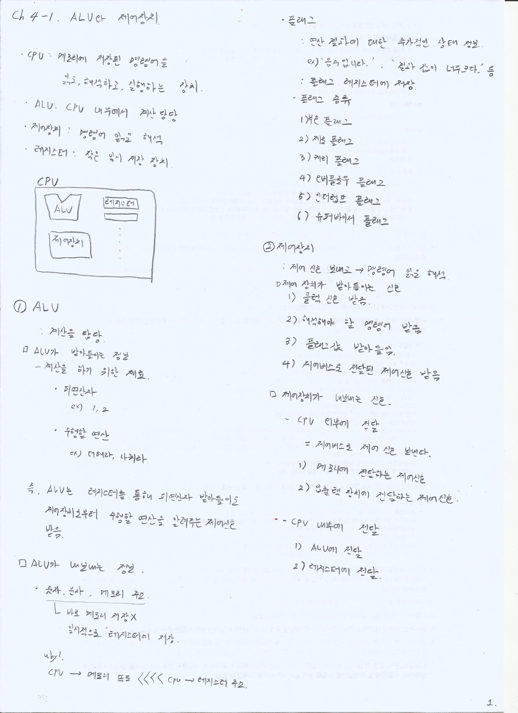

> 📚 참고: 강민철 지음, 혼자 공부하는 컴퓨터구조 + 운영체제

## 🧠 핵심 개념 한눈에 보기

- **ALU(Arithmetic Logic Unit)**: CPU 내부에서 산술·논리 연산을 수행하는 장치

- **제어장치(Control Unit)**: 명령어를 해석하고 각 부품으로 제어 신호를 내보내는 장치

- **레지스터(Register)**: CPU 내부의 초고속 저장소. 연산 대상·중간 결과·상태(플래그)를 보관

  

## 🧮 ALU가 다루는 입력과 출력

- 입력: 레지스터에 있는 피연산자(예: 1, 2), 제어장치가 내보내는 제어 신호

- 출력: 계산 결과 값, 그리고 결과의 상태를 나타내는 **플래그**(조건 코드)

  

## 🚩 플래그(조건 코드) 종류

연산 결과에 대한 추가 정보를 나타내며, 분기/예외 처리 등에 활용됩니다.

| 플래그 | 의미 | 세부 설명 |
|---|---|---|
| Zero(Z) | 결과가 0인지 | 연산 결과가 0이면 1, 아니면 0 |
| Sign(S)/Negative(N) | 부호 비트 | 결과의 최상위 비트(부호)가 1이면 음수로 간주 |
| Carry(C) | 자리올림/자리내림 발생 | 무부호 덧셈의 자리올림, 뺄셈의 자리내림 발생 여부 |
| Overflow(V) | 부호 있는 오버플로 | 2의 보수 해석에서 범위를 벗어나면 1 |
| Parity(P) | 패리티 | 결과의 1 비트 개수의 짝/홀 여부(일부 ISA에서 사용) |
| Auxiliary Carry(AC)/Half Carry(H) | 하프 바이트 자리올림 | BCD/니블 연산 보정에 사용(일부 ISA 전통) |

## 🧭 제어장치의 역할

1) 명령어 해독: 다음에 수행할 동작과 필요한 피연산자 위치 해석  
2) 제어 신호 생성: ALU, 레지스터 파일, 메모리/버스, 입출력 장치로 신호 전송  
3) 플래그/상태 참조: 분기 판단 등 흐름 제어에 활용

## ⚡ 레지스터와 메모리의 속도 차이, 그리고 성능

> 메모리 접근은 레지스터 접근보다 훨씬 느립니다.  
> 그래서 `CPU -> 메모리 속도 <<<< CPU -> 레지스터 속도` 라고 표현합니다.

- 대략적 감각치(세대/구성 따라 다름):
  - 레지스터 접근: 수 피코초(ps) 수준
  - L1/L2 캐시: 수~수십 나노초(ns)
  - 메인 메모리(DRAM): 수십~수백 나노초(ns)

- 이유:
  - 레지스터는 CPU 코어 내부에 위치해 배선 길이가 짧고 클럭과 동속으로 동작
  - 메모리는 칩 바깥(또는 멀리) 있어 버스/컨트롤러/대역폭/대기시간(latency) 오버헤드가 큼

- 실무적 사실:
  - 동일 작업이라면 "레지스터/캐시에서 처리"가 "메모리 왕복"보다 훨씬 빠릅니다.
  - 반복적으로 메모리로 데이터를 읽고 쓰면 대기 시간이 누적되어 프로그램이 **체감상 매우 느려**집니다.
  - 그래서 CPU는 **레지스터 -> 캐시 -> 메모리**로 이어지는 **계층적 메모리 구조**를 사용하고, 컴파일러/프로그래머는 **레지스터 재사용, 지역성(locality) 향상**을 통해 메모리 왕복을 줄이려 합니다.

> 요약: 가능한 한 데이터를 레지스터/캐시에 머물게 하라. 빈번한 메모리 접근은 성능의 최대 병목입니다.

## ✅ 핵심 요약

- ALU는 연산을, 제어장치는 해석과 신호 생성을 담당한다.
- 플래그는 연산 결과의 상태를 표현하며 분기 판단에 활용된다.
- 레지스터 접근은 메모리보다 **몇 배에서 수십 배 이상** 빠르며, 메모리 왕복이 잦으면 전체 실행 속도가 크게 떨어진다.

## 📝 학습 노트 스캔

> 원본 필기 이미지

