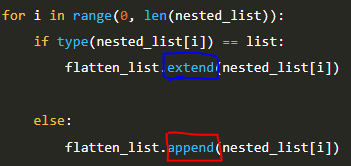

list에 새로운 요소를 추가 해주는 append()와 extend() 함수를 공부하고 관련 문제를 풀던 중 헷갈리고 궁금한 점이 있어 공부 및 기록

## 문제
[1, 2, [3, 4], 5, [6, 7], [8, 9]] 인 이중 중첩 list를 1차원 리스트인 [1, 2, 3, 4, 5, 6, 7, 8, 9]로 바꾸는 문제


## 당시 해결 풀이

```python
nested_list = [1, 2, [3, 4], 5, [6, 7], [8, 9]]
flatten_list = []

for i in range(0, len(nested_list)):
    if type(nested_list[i]) == list:
        flatten_list.extend(nested_list[i])

    else:
        flatten_list.append(nested_list[i])


print(raw_list)
print("{}를 평탄화하면\n"
      "{}입니다.".format(nested_list, flatten_list))
```

    [1, 2, [3, 4], 5, [6, 7], [8, 9]]를 평탄화하면
    [1, 2, 3, 4, 5, 6, 7, 8, 9]입니다.


## 궁금한 점



파란색과 빨간색 네모 칸 안에 있는 extend()와 append() 함수의 차이점이다.

당시, 처음 문제 풀 때 둘 다 append() 함수를 사용했었는데  
그때는 nested_list인 [1, 2, [3, 4], 5, [6, 7], [8, 9]] 그대로 출력이 되어서 뭐지 싶었다.

이제부터 차이점을 알아보자!

## 차이점
### <span style="background-color:#495057"> extend() 함수 </span>
extend() 함수는 [1, 2]를 extend()해서 가져다 붙인다고 하면 list를 통째로 붙이는 것이 아니라 list 안에 요소 하나하나를 가져다 붙이는 것

### <span style="background-color:#495057"> append() 함수 </span>
append() 함수는 [1, 2]를 append() 한다고 하면 list 통째로 [1, 2] 그대로 붙이는 것이다. 


### 코드를 통한 이해

```python
x = [1, 2, 3]
y = [4, 5]
x.append(y)
print('append:',x)

x = [1, 2, 3]
y = [4, 5]
x.extend(y)
print('extend:',x)
```

    append: [1, 2, 3, [4, 5]]
    extend: [1, 2, 3, 4, 5]

append() 함수를 쓰면 [4, 5]를 하나 요소로 생각하고,  
extend() 함수를 쓰면 list 안의 요소들을 풀어서 하나하나 붙인다.

## 요약
**append()는 리스트에 단일 요소(예: 리스트, 튜플, 숫자 등)를 추가**    
**extend()는 리스트에 다른 iterable의 요소를 각각 추가하는 데 사용**

<br>

## 추가적인 공부-1
개인적으로 리스트에 문자열을 append()나 extend() 하면 어떻게 될지 궁금해졌다.

```python
x = [1,2,3]
y = 'pa_kko'
x.append(y)
print('append:',x)

x = [1,2,3]
y = 'pa_kko'
x.extend(y)
print('extend:',x)
```
    append: [1, 2, 3, 'pa_kko']
    extend: [1, 2, 3, 'p', 'a', '-', 'k', 'k', 'o']

<br>

## 추가적인 공부-2
추가적인 공부-1에서는 문자열을 추가했지만 이번에는 리스트에 int형 하나를 넣으면 어떻게 될까? 라는 생각을 했다.

```python
x = [1,2,3]
y = 4
x.append(y)
print('append:',x)

x = [1,2,3]
y = 4
x.extend(y)
print('extend:',x)
```


y = 4는 iterable이 아니라 int 형인 단일 요소이기 때문에 extend()를 하면 오류가 난다.

<br>

## 추가적인 공부-3
그럼 extend()를 통해 단일 요소를 추가하고 싶으면?!

```python
x = [1,2,3]
y = (4,)          # 단일 요소 튜플을 생성
x.extend(y)
print('extend:',x)
```

    extend: [1, 2, 3, 4]

위 코드와 같이 y = (4,)인 단일 요소 튜플을 생성하면 된다.

여기서 주의할 점은  
y = (4)는 단순히 정수 4인 것이고 y = (4,)와 같이 요소 뒤에 ','를 추가해야 튜플이 된다는 점
