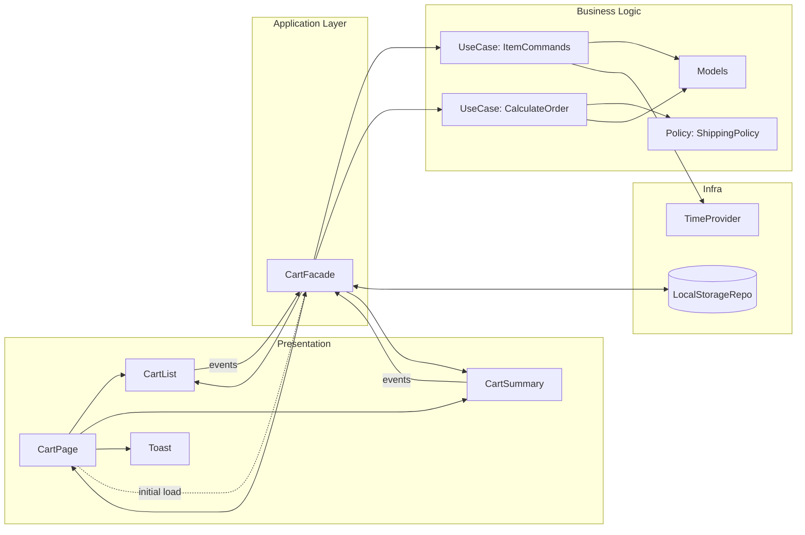

# 🛒 Day 2 실습: 장바구니 모듈화 경험기

## 들어가며
Day 2 실습 주제는 바로 **장바구니 페이지**였다.  
싱글턴때도 그렇고 이번에도 **예시 이미지 없이 글과 설계**만으로 풀어나가기로 했고,  
LocalStorage 기반으로 작동하는 장바구니 기능을 직접 모듈화 설계하면서 진행했다.


## 요구사항과 프롬프트
우선 장바구니 기능들을 정리한 후, LLM 모델에게 아래와 같은 프롬프트를 주었다.

<details markdown="1">
<summary>프롬프트 원문 보기</summary>

````markdown
다음 요구사항을 구현하기위한 최소한의 모듈화 설계 진행하라.
반드시 다음 순서를 따라야한다.
1. 요구사항을 분석하여 자세한 user flow, data flow를 작성한다
...
(이후 완벽한 프롬프트는 교육자료에 제시해준 내용..)

---
(공지사항)
- 반드시 루트 페이지로 작업하세요.
- 모든 데이터는 local storage로 관리된다.
- 데이터가 undefined면 초기 더미데이터를 삽입한다. 아니면 존재하는 값을 사용한다.

(개요 및 기능)
장바구니 페이지를 만들어 내가 살 물건과 아닌 물건을 선택을 하고 우측에 '주문 요약' 을 통해서 선택된 상품에 대한 '총 상품 가격'과 '배달비' 를 확인할 수 있고 얼마를 더 구매하면 무료 배송을 할 수 있는지 알 수 있게 해준다. 이 후 '총 결제 금액'이 나오고 결제하기 버튼까지 누를 수 있게 한다.

(장바구니)
- 상품을 선택할 수 있으며, ‘전체 선택’도 가능하다. 
- 상품의 수량을 조절할 수 있다.

- 좌측에는 상품 이미지, 이름, 개당 가격이 나오고 우측에는 개수 선택, 선택된 개수만큼에 대한 가격이 표시되게한다.
- 개별로 상품 삭제 할 수 있는 버튼을 통해 상품 삭제가능
- 선택된 상품들도 한번에 삭제하기 버튼을 통해 가능

(주문 요약)
- 상품 금액 합, 배송비, 총 결제금액이 안내된다.
- 선택된 상품 금액 합이 5만원 미만인 경우, 배송비 3천원이 부과된다.
- 50000원 미만일 경우 얼마를 추가하면 배송비가 무료라는 글씨가 나오게하고 50000원 이상이면 배송비 무료라는 글씨가 나오게한다.
- 혹여나 스크롤이 된다면 주문 요약 창은 따라올 수 있게 한다.

(결제하기 버튼)
- 상품이 하나도 선택되지 않으면 결제하기 버튼은 활성화 되지 않는다.
- 결제하기 버튼을 눌렀을때는 아직 데모버전이기에 우측 하단에 '결제가 진행중입니다.' 라는 알람이 뜨게해줘.

(장바구니 상품 목록)
에어팟 : 200000원
유선 마우스 : 35000원
텀블러 : 20000원
포스트잇 : 1000원
볼펜 : 3000원
스마트워치 : 180000원
USB-C 케이블 : 4900원

(개발 및 디자인 참고사항)
- 데스크톱/모바일에서 정상적으로 조회할 수 있다.
- 화면 너비에 따른 반응형 디자인이 지원된다.
````

</details>


## LLM이 만들어준 설계 결과
LLM은 요구사항을 받아 아래와 같은 구조로 답변을 주었다.

<details markdown="1">
<summary>LLM 설계 응답 보기</summary>

````markdown
# 장바구니 모듈화 설계 (루트 페이지 / LocalStorage 기반)
## 1) 요구사항 분석 → User Flow & Data Flow

### User Flow (행동 단계)
1. 초기 진입
   - 루트 페이지(`/index.html`) 접속 → LocalStorage에 `cartItems` 없으면 초기 더미데이터 시드 삽입.
   - 장바구니 리스트 렌더링, 우측 주문 요약 패널 노출(모바일에서는 하단 고정).
2. 선택/수정
   - 개별 체크박스 / 전체 선택 체크.
   - `+ / -` 또는 입력으로 수량 조정.
   - 개별 삭제 또는 선택 삭제.
3. 요약 확인
   - 선택된 항목 기준 상품금액 합 계산.
   - 50,000원 미만이면 배송비 3,000원·무료배송까지 남은 금액 문구 노출,
     50,000원 이상이면 배송비 0원 + “무료배송” 문구.
   - 총 결제 금액 = 상품합 + 배송비.
4. 결제 버튼
   - 선택된 상품이 없으면 비활성화.
   - 클릭 시 우측 하단 토스트: “결제가 진행중입니다.”
5. 반응형 & 스크롤
   - 데스크톱/모바일 대응.
   - 주문 요약 패널 position: sticky(모바일은 하단 고정 바).

### Data Flow (상태·저장·파생값)
- 저장소(LocalStorage) 키
  - `cartItems`: 장바구니 배열
  - `cartSelection`: 선택된 itemId 목록
- 도메인 모델
  type CartItem = {
    id: string;               // 고유 ID
    name: string;             // 상품명
    price: number;            // 개당 가격(원)
    qty: number;              // 수량(1 이상 정수)
    imageUrl?: string;        // 이미지 경로(선택)
    createdAt: string;        // ISO
    updatedAt: string;        // ISO
  };

* 파생 계산값

  * `selectedSubtotal` = Σ(선택된 항목의 price \* qty)
  * `shippingFee` = selectedSubtotal < 50000 ? 3000 : 0
  * `freeShippingDelta` = max(0, 50000 - selectedSubtotal)
  * `grandTotal` = selectedSubtotal + shippingFee
* 이벤트 흐름

  * UI 이벤트 → Facade(프리젠테이션 서비스) → UseCase(도메인 규칙) → Repository(LocalStorage 어댑터)
  * 계산/검증은 UseCase에서만 수행(프리젠테이션은 순수 View).

---

## 2) 코드베이스 컨벤션 가이드(가정 기반 스캔 결과)

* 경로 구조(제안)

  ```
  /index.html            # 루트 페이지(단일 페이지)
  /assets/               # 이미지·아이콘
  /styles/               # CSS (BEM 네이밍, 모바일 우선)
    cart.css
  /src/
    main.ts              # 부트스트랩(초기 시드 & 렌더 트리거)
    presentation/        # View + 이벤트 바인딩 (비즈니스 로직 금지)
      cart-page.ts
      components/
        cart-list.ts
        cart-summary.ts
        toast.ts
    application/         # 프리젠테이션-도메인 사이 퍼사드
      cart-facade.ts
    domain/              # 순수 비즈니스 로직
      models.ts
      usecases/
        calculate-order.ts
        item-commands.ts
      policies/
        shipping-policy.ts
    infra/               # I/O, 어댑터
      storage/
        local-storage-repo.ts
      gateway/
        time-provider.ts
    tests/               # 비즈니스 로직 단위 테스트
      calculate-order.spec.ts
      item-commands.spec.ts
      shipping-policy.spec.ts
  ```


* 네이밍/스타일

  * 파일: `kebab-case`, 클래스/타입: `PascalCase`, 함수/변수: `camelCase`
  * CSS: BEM(`.cart__item`, `.summary__total`)
  * 단위: 원화 정수(콤마 포맷은 View에서)
  * 시간: `toISOString()` 저장

* 의존성 원칙

  * `presentation → application → domain → infra` 방향 단방향 의존
  * `domain`은 런타임 API/브라우저 객체에 의존 금지

* 테스트 원칙

  * 비즈니스 로직 100% 단위 테스트 (입력→출력 순수 함수 검증)
  * 프리젠테이션은 QA 시트 기반 수동/시나리오 테스트

---

## 3) 모듈 및 작업 위치 설계 (Presentation/Business Logic 완전 분리)

### 개요 (모듈 이름 · 위치 · 설명)

* Main Bootstrap — `/src/main.ts`
  초기 데이터 시드, Facade 초기화, 페이지 렌더 트리거.
* CartPage(View Shell) — `/src/presentation/cart-page.ts`
  레이아웃/반응형/스크롤 감시. 하위 컴포넌트 조립.
* CartList(Component) — `/src/presentation/components/cart-list.ts`
  목록/수량/체크박스/개별삭제/선택삭제 UI + 이벤트 바인딩.
* CartSummary(Component) — `/src/presentation/components/cart-summary.ts`
  상품합/배송비/무료배송 문구/총결제/결제 버튼 상태 UI.
* Toast(Component) — `/src/presentation/components/toast.ts`
  “결제가 진행중입니다.” 우측 하단 알림.
* CartFacade(Application Service) — `/src/application/cart-facade.ts`
  View 이벤트를 UseCase/Repo 호출로 연결. 화면용 DTO 생성.
* UseCases – CalculateOrder — `/src/domain/usecases/calculate-order.ts`
  선택 합계/배송비/총액/문구 계산의 단일 진실.
* UseCases – ItemCommands — `/src/domain/usecases/item-commands.ts`
  선택/해제/전체선택/수량증감/삭제/선택삭제 규칙.
* Policy – ShippingPolicy — `/src/domain/policies/shipping-policy.ts`
  무료배송 임계(50,000), 배송비(3,000) 상수·규칙 캡슐화.
* Models — `/src/domain/models.ts`
  `CartItem` 등 타입·가드(유효성).
* Repository(LocalStorage) — `/src/infra/storage/local-storage-repo.ts`
  `getItems/setItems/getSelection/setSelection/seedIfEmpty`.
* TimeProvider — `/src/infra/gateway/time-provider.ts`
  테스트 가능한 시각 주입(생성/업데이트 타임스탬프).
* Tests — `/src/tests/*.spec.ts`
  도메인 단위 테스트.

---

## Diagram (mermaid)



---

## Implementation Plan

### 공통 상수/규칙

* 무료배송 임계값: `FREE_SHIPPING_THRESHOLD = 50000`
* 배송비: `SHIPPING_FEE = 3000`
* 통화 포맷: `Intl.NumberFormat('ko-KR')` (View 전용)

### 초기 더미데이터(시드)

* 에어팟 200000, 유선 마우스 35000, 텀블러 20000, 포스트잇 1000, 볼펜 3000, 스마트워치 180000, USB-C 케이블 4900
  → `qty=1`, `selected=false`, 이미지 경로는 임시(placeholders)

---

### Presentation (View & 이벤트) — QA Sheet 포함

#### 1) `/src/presentation/cart-page.ts`

* 역할

  * 루트 컨테이너 생성/마운트.
  * 레이아웃 구역: 좌측 리스트 / 우측 요약.
  * 주문 요약 패널 **sticky**(데스크톱), 모바일 하단 고정.
* 주요 작업

  * 리사이즈 → 클래스 토글(`is-mobile`), 요약 위치 조정.
  * 초기 렌더 트리거 및 Facade 구독.

#### 2) `/src/presentation/components/cart-list.ts`

* 역할

  * 전체 선택 체크박스.
  * 항목 행: 이미지/이름/개당 가격/수량 스피너/행 금액/체크박스/삭제.
  * 선택 삭제 버튼.
* 이벤트 바인딩

  * `onToggleAll()`, `onToggleItem(id)`, `onQtyChange(id, +1/-1|value)`, `onRemove(id)`, `onRemoveSelected()`.
* 렌더 입력

  * `CartListVM = { items: Array<{id, name, priceFmt, qty, lineTotalFmt, selected, imageUrl}> , allSelected: boolean }`.

#### 3) `/src/presentation/components/cart-summary.ts`

* 역할

  * 상품 금액 합 / 배송비 / 총 결제 금액 표시.
  * 무료배송 남은 금액 문구 또는 무료배송 문구.
  * 결제 버튼 활성/비활성.
* 이벤트 바인딩

  * `onCheckout()` → 토스트 호출.

#### 4) `/src/presentation/components/toast.ts`

* 역할

  * 하단 우측 토스트: “결제가 진행중입니다.” (3초 자동 사라짐)
* API

  * `show(message: string, type?: 'info'|'success'|'error')`

#### Presentation QA Sheet (수동 테스트 체크리스트)

| ID    | 시나리오       | 스텝            | 기대결과                           |
| ----- | ---------- | ------------- | ------------------------------ |
| UI-01 | 초기 로드      | 첫 방문          | 리스트가 더미데이터로 채워지고, 요약은 0원(선택 전) |
| UI-02 | 전체 선택      | 상단 ‘전체 선택’ 클릭 | 모든 항목 체크, 상품합=모든 합계            |
| UI-03 | 개별 선택      | 임의의 두 항목 선택   | 상품합=선택 항목 합계만 반영               |
| UI-04 | 수량 증가      | 선택된 항목 `+`    | 행 금액/상품합/총결제 즉시 갱신             |
| UI-05 | 수량 감소      | `-` 후 1 미만 시도 | 최소 1에서 더 감소 불가(UI 가드)          |
| UI-06 | 개별 삭제      | 항목 삭제 클릭      | 항목 제거, 합계 재계산                  |
| UI-07 | 선택 삭제      | 여러 항목 선택 후 삭제 | 선택 항목 일괄 삭제                    |
| UI-08 | 배송비 규칙(미만) | 선택합 49,900원   | 배송비 3,000원, “5만원 더 구매…” 문구     |
| UI-09 | 배송비 규칙(이상) | 선택합 50,000원   | 배송비 0원, “무료배송” 문구              |
| UI-10 | 결제 버튼 비활성  | 선택 0개         | 버튼 비활성                         |
| UI-11 | 결제 버튼 활성   | 선택 ≥1개        | 버튼 활성                          |
| UI-12 | 결제 토스트     | 결제 클릭         | “결제가 진행중입니다.” 토스트 3초 표시        |
| UI-13 | 스크롤 고정     | 긴 리스트 스크롤     | 요약 패널 sticky 유지(모바일: 하단 바)     |
| UI-14 | 반응형        | 360px\~       | 모바일 1열, 데스크톱 2열 레이아웃 정상        |
| UI-15 | 새로고침 지속    | F5            | 선택/수량/데이터 유지(LocalStorage)     |

---

### Business Logic (Domain) — Unit Test 포함

#### 5) `/src/domain/policies/shipping-policy.ts`

* 기능

  * `getShippingFee(subtotal: number): number`
  * `getFreeShippingDelta(subtotal: number): number`
  * 상수 캡슐화: `THRESHOLD=50000`, `FEE=3000`
* 테스트

  * `subtotal < 50000 → fee=3000, delta>0`
  * `subtotal = 50000 → fee=0, delta=0`
  * `subtotal > 50000 → fee=0, delta=0`

#### 6) `/src/domain/usecases/calculate-order.ts`

* 입력

  * `items: CartItem[]`, `selectedIds: string[]`
* 출력

  type OrderCalc = {
    selectedSubtotal: number;
    shippingFee: number;
    freeShippingDelta: number;
    grandTotal: number;
    isFreeShipping: boolean;
    hasSelection: boolean;
  };

* 규칙

  * 선택 항목만 합산, 음수/NaN 보호, 소수점 금지(정수 KRW).
* 테스트

  * 선택 없음 → 전부 0, `hasSelection=false`
  * 경계값 49,999 / 50,000 / 50,001 케이스
  * 큰 수량/여러 항목 합산 정합성
  * 특이값(0/음수/소수) 입력 방어

#### 7) `/src/domain/usecases/item-commands.ts`

* 명령형 API

  * `toggleAll(items, allSelected: boolean): string[]`
  * `toggleOne(selectedIds, id): string[]`
  * `updateQty(items, id, nextQty): CartItem[]` (최소 1 보장)
  * `removeOne(items, id): CartItem[]`
  * `removeSelected(items, selectedIds): CartItem[]`
* 불변성

  * 입력 리스트를 복사 후 반환.
* 테스트

  * 전체선택/해제 토글 검증
  * 수량 1에서 감소 시 1 유지
  * 삭제/선택삭제 후 항목 수·선택 집합 정합
  * 대량 항목 성능(기본 O(n))

#### 8) `/src/domain/models.ts`

* 타입/가드

  * `isCartItem(x): x is CartItem`
  * `sanitizeQty(qty): number` (정수/최소1 강제)
* 테스트

  * 타입 가드 참/거짓 케이스
  * 수량 정규화(0/음수/소수 → 1)

---

### Application Layer

#### 9) `/src/application/cart-facade.ts`

* 역할

  * View 이벤트 → 도메인 UseCase + Repo 호출 조합.
  * 화면용 ViewModel 생성(통화 포맷, 라인합계 문자열 등).
* 주요 메서드

  * `load(): CartVM` — 저장소 로드 + 계산 + VM 변환
  * `toggleAll()`, `toggleItem(id)`
  * `incQty(id)`, `decQty(id)`, `setQty(id, value)`
  * `remove(id)`, `removeSelected()`
  * `checkout()` — 토스트 트리거(실결제 없음)
* 상태 동기화

  * 모든 명령 후 `repo.save(items, selection)` 호출, `calculate-order` 재계산.

---

### Infra

#### 10) `/src/infra/storage/local-storage-repo.ts`

* 역할

  * LocalStorage JSON (try/catch 안전) 읽기/쓰기.
  * `seedIfEmpty()` — 초기 데이터 삽입.
* API

  * `getItems(): CartItem[]`
  * `setItems(items: CartItem[]): void`
  * `getSelection(): string[]`
  * `setSelection(ids: string[]): void`
  * `seedIfEmpty(defaults: CartItem[]): void`

#### 11) `/src/infra/gateway/time-provider.ts`

* 역할

  * `now(): string` → ISO 문자열(테스트 대체 가능)

---

### 스타일/접근성

* `/styles/cart.css`

  * 그리드(데스크톱 2열: 리스트/요약), 모바일 1열 + 요약 하단 고정.
  * 요약 패널: `position: sticky; top: 16px;`
  * 버튼 비활성화: `:disabled` 스타일
  * 체크박스 크기/포커스 링, 키보드 접근성(Tab 순서).

---

## 마이그레이션/릴리즈 메모

* 초기 릴리즈

  * 도메인 단위 테스트 통과 후 배포.
  * 로컬스토리지 키 충돌 방지용 prefix(`cart.`) 적용 권장.
* 확장 포인트

  * 배송 정책 다국가/티어링 → `ShippingPolicy` 파라미터화.
  * 쿠폰/포인트 → 새로운 `Policy`/`UseCase` 추가로 확장.

---

## 완료 기준(Definition of Done)

* 프리젠테이션 QA 시트 전 항목 Pass.
* 도메인 단위 테스트 그린.
* 신규 방문 시 시드 데이터 자동 주입, 재방문 시 상태 보존.
* 모바일/데스크톱 반응형 정상.
* 선택 0건 시 결제 비활성, 클릭 시 토스트 노출.
````

</details>


## 추가 개선 요청
처음 생성된 결과물을 보고 아쉬운 부분들을 수정하기 위해 프롬프트를 한 번 더 보냈다.

```markdown
### 수정 요청 사항
- 다크 모드 → 라이트 테마 전환
- 수량 버튼 호버/삭제 버튼 강조
- 장바구니 타이틀 글씨 키우고 상품 개수 표시
- 삭제 버튼 → 쓰레기통 아이콘
- 삭제 시 되돌리기 기능 추가
- 수량 텍스트 가운데 정렬
```

단 2번의 프롬프트로 수정까지 완료할 수 있었다는 점이 놀라웠다.


## 배포와 결과물
로컬 서버에서 확인 후 Vercel로 배포까지 완료했다.  
👉 결과물: [https://pakko-vibemafia-test2.vercel.app/](https://pakko-vibemafia-test2.vercel.app/)


## 느낀 점
점점 어떤식으로 LLM에게 구체적으로 기능적인 것을 설명해야하는지도 점점 감이 오는 것 같다.  
오히려 만들어지는 시간보다 어떤 기능들을 어떻게 적을까에 대한 소요시간이 더 길었다.  
이런 것을 보면 오히려 미래에는 이런 모든 것들을 기획하는 개발에 대한 지식이 있는 기획자들이 세상을 펼칠 수 있는 시대가 오지 않을까? 라는 생각이 들었다.  
나는 앞으로 DX/AX 라는 말이 나오는 시대에 맞춰서 AI를 활용한 데이터 분석, AI 기반 자동화 등을 많이 연습해봐야겠다.  


